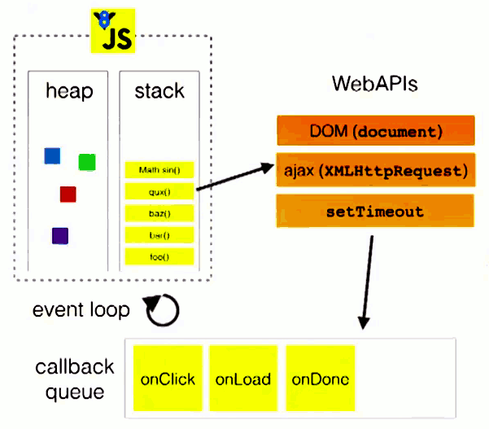

### 为什么?
- Node是单线程的吗？
- 什么是事件循环?

- JS是如何实现异步的，之前的认知:




[What the heck is the event loop anyway? | Philip Roberts | JSConf EU
](https://www.youtube.com/watch?v=8aGhZQkoFbQ&t=38s)


### Node中的事件循环 Event Loop

> 一个while()循环，将请求分配给C++，将结果返回给JavaScript


### Node 启动过程
`src/node.cc`
```c++
int Start(int argc, char** argv) {
  	// 创建主进程实例对象
    NodeMainInstance main_instance(&params,
        // 初始化一个default_loop
        uv_default_loop(), 
        per_process::v8_platform.Platform(),
        result.args,
        result.exec_args,
        indexes);
  	// 开始主进程
    result.exit_code = main_instance.Run();
  }
  return result.exit_code;
}
```

> node原封不动的使用了libuv的event loop

`deps/uv/src/uv-common.c` 这是一个 `libuv` 库
```c++
// libuv提供一个默认的loop
// node.js所使用的就是这个默认的loop
uv_loop_t* uv_default_loop(void) {
  if (default_loop_ptr != NULL)
    return default_loop_ptr;
  if (uv_loop_init(&default_loop_struct))
    return NULL;
  default_loop_ptr = &default_loop_struct;
  return default_loop_ptr;
}
```
[libuv 官网](http://docs.libuv.org/en/v1.x/guide/basics.html): 
这个event loop做的事情
```js
while there are still events to process:
    e = get the next event
    if there is a callback associated with e:
        call the callback
```

event 包括:
- **file** is ready for writing
- a **socket** has data ready to be read
- a **timer** has timedout

libuv 向特定的事件注册对应的行为 `handle`。
- 也就是创建对应的 `handle` 对象
  - 表示对某一类事件所做出的行为
- `handle` 对象可以使用相应的 `request` 对象
  - 表示handle上的一个I/O操作

```c++
/* Handle types. */
typedef struct uv_loop_s uv_loop_t;
typedef struct uv_handle_s uv_handle_t;
typedef struct uv_dir_s uv_dir_t;
typedef struct uv_stream_s uv_stream_t;
typedef struct uv_tcp_s uv_tcp_t;
typedef struct uv_udp_s uv_udp_t;
typedef struct uv_pipe_s uv_pipe_t;
typedef struct uv_tty_s uv_tty_t;
typedef struct uv_poll_s uv_poll_t;
typedef struct uv_timer_s uv_timer_t;
typedef struct uv_prepare_s uv_prepare_t;
typedef struct uv_check_s uv_check_t;
typedef struct uv_idle_s uv_idle_t;
typedef struct uv_async_s uv_async_t;
typedef struct uv_process_s uv_process_t;
typedef struct uv_fs_event_s uv_fs_event_t;
typedef struct uv_fs_poll_s uv_fs_poll_t;
typedef struct uv_signal_s uv_signal_t;

/* Request types. */
typedef struct uv_req_s uv_req_t;
typedef struct uv_getaddrinfo_s uv_getaddrinfo_t;
typedef struct uv_getnameinfo_s uv_getnameinfo_t;
typedef struct uv_shutdown_s uv_shutdown_t;
typedef struct uv_write_s uv_write_t;
typedef struct uv_connect_s uv_connect_t;
typedef struct uv_udp_send_s uv_udp_send_t;
typedef struct uv_fs_s uv_fs_t;
typedef struct uv_work_s uv_work_t;
```


`src/node_main_instance.cc`

```c++
int NodeMainInstance::Run() {
  // 循环控制参数
  bool more;
  // 开始事件循环
  do {
    // uv_run 封装了整个事件循环
    // event_loop就是前面libuv初始化的uv_default_loop
    uv_run(env->event_loop(), UV_RUN_DEFAULT);
    // 判断loop是否alive:是否有active handles/requests
    more = uv_loop_alive(env->event_loop());

    if (more && !env->is_stopping()) continue;
    
    if (!uv_loop_alive(env->event_loop())) {
      EmitBeforeExit(env.get());
    }
    
  } while (more == true && !env->is_stopping());
}
```

事件循环的两种实现：`deps/uv/src/unix/core.c` , `deps/uv/src/win/core.c`

```c++
int uv_run(uv_loop_t* loop, uv_run_mode mode) {
  int timeout, r, ran_pending;
  r = uv__loop_alive(loop);
  if (!r) uv__update_time(loop);
  while (r != 0 && loop->stop_flag == 0) {
    // 更新当前的时间, now，用来判断最近的timer
    uv__update_time(loop);
    // 拿到最近的timer，如果有多个timeout相同会全部拿出来，执行它们的回调函数
    uv__run_timers(loop);
    // loop内部维护了一个pending_queue待执行的回调队列
    // 从回调队列中拿出队列中所有等待执行的callback，执行它们
    ran_pending = uv__run_pending(loop);

    uv__run_idle(loop);
    // 准备处理blocking I/O操作
    uv__run_prepare(loop);

    timeout = 0;
    // 计算阻塞I/O多长时间，取最接近的timers，如果没有timers就是INT_MAX
    if ((mode == UV_RUN_ONCE && !ran_pending) || mode == UV_RUN_DEFAULT)
      timeout = uv_backend_timeout(loop);
    // 处理blocking I/O，这里调用了 epoll
    uv__io_poll(loop, timeout);
    uv__run_check(loop);
    // 处理close回调，比如 socket.on('close')
    uv__run_closing_handles(loop);

    if (mode == UV_RUN_ONCE) {
      uv__update_time(loop);
      uv__run_timers(loop);
    }

    r = uv__loop_alive(loop);
    if (mode == UV_RUN_ONCE || mode == UV_RUN_NOWAIT)
      break;
  }

  if (loop->stop_flag != 0)
    loop->stop_flag = 0;

  return r;
}
```

`deps/uv/src/unix/linux-core.c`
```c++
void uv__io_poll(uv_loop_t* loop, int timeout) {

 
 while (!QUEUE_EMPTY(&loop->watcher_queue)) {
    // ...
    if (w->events == 0)
      op = EPOLL_CTL_ADD;
    else
      op = EPOLL_CTL_MOD;
    // 添加文件描述符
    if (epoll_ctl(loop->backend_fd, op, w->fd, &e)) {
      if (errno != EEXIST)
        abort();
      if (epoll_ctl(loop->backend_fd, EPOLL_CTL_MOD, w->fd, &e))
        abort();
    }

    w->events = w->pevents;
  }
  // this is the event loop
  for (;;) {
    /* See the comment for max_safe_timeout for an explanation of why
     * this is necessary.  Executive summary: kernel bug workaround.
     */
    if (sizeof(int32_t) == sizeof(long) && timeout >= max_safe_timeout)
      timeout = max_safe_timeout;
    // 阻塞并等待文件描述符上的 events 执行
    nfds = epoll_pwait(loop->backend_fd,
                       events,
                       ARRAY_SIZE(events),
                       timeout,
                       psigset);
    have_signals = 0;

    for (i = 0; i < nfds; i++) {  
      if (pe->events != 0) {
        if (w == &loop->signal_io_watcher)
          have_signals = 1;
        else
          // 执行回调函数
          w->cb(loop, w, pe->events);
        nevents++;
      }
    }

    if (have_signals != 0)
      // 执行回调函数
      loop->signal_io_watcher.cb(loop, &loop->signal_io_watcher, POLLIN);
}
```
> Unix底层使用了 epoll 实现执行I/O操作


### 线程池

在Node中有两类线程，都由libuv提供：
1. Event Loop (main loop, main thread, event thread, etc)
2. Worker Pool 线程池 (Thread Pool)

使用线程池的任务：
- I/O密集型
  - `dns.lookup()`, `dns.lookupService()`
  - `fs.*` 除了 `fs.FSWatcher()`
- CPU密集型
  - `crypto`: 
    - `crypto.pbkdf2()`
    - `crypto.scrypt()`
    - `crypto.randomBytes()`
    - `crypto.randomFill()` 
    - `crypto.generateKeyPair()`
  - `zlib.*`

使用 epoll 的任务
- **networking**: `tcp`, `udp`
- `pipes` 大部分
- `dns.resolveXXX()`

### DEMO
1. `libuv-epoll.js` vs `thread-pool.js`
2. `setTimeout()` 并不一定按时执行 `timer.js`


### Node 10.* 的一个 Bug

`bug.js`

```js
// https://github.com/nodejs/node/issues/22257
for (let i = 0; i < 2; i++) {
  // macrotask
  setTimeout(() => {
    console.log('Timeout', i)
    // microtask
    Promise.resolve()
      .then(() => console.log('Promise 1', i))
      .then(() => console.log('Promise 2', i))
  }, 0)
}
```

> 在 node v11 已经修复了

### MicroTask vs MacroTask 

> MicroTask 和 MacroTask 是前端概念，来自于html spec。并没有在 node.js 任何文档中发现这两个术语。[html spec](https://html.spec.whatwg.org/multipage/webappapis.html#task-queue)


- [Tasks, microtasks, queues and schedules](https://jakearchibald.com/2015/tasks-microtasks-queues-and-schedules/)


- [stackoverflow: difference between microtask and macrotask within an event loop context](https://stackoverflow.com/questions/25915634/difference-between-microtask-and-macrotask-within-an-event-loop-context)

- 一个event loop有一个或多个task queue，（前面提到的，每个阶段都有自己的task queue，只有清空task queue才会进入下一个阶段）
- 一个event loop只有一个microtask queue
- task queue = macrotask queue != microtask queue
- 一个task可能被推入microtask queue或者macrotask queue


> Microtasks are usually scheduled for things that should happen straight after the currently executing script.

#### 区别在哪
简单来说异步任务可以分为两种：
1. 追加在本轮循环中的异步任务
  - microtask queue: `Promise`
  - nextTick queue: `nextTick`
2. 追加在次轮循环中的异步任务
  - macrotask queue: `timers` `callbacks` 

- Node 规定，`process.nextTick()` 和 `Promise()` 的回调函数，追加在本轮循环，即同步任务一旦执行完成，就开始执行它们。而setTimeout、setInterval、setImmediate (Macrotask)的回调函数，追加在次轮循环。

- event loop 中并没有涉及 `process.nextTick()`, 因为 `process.nextTick()` 并不是 event loop 的一部分，`nextTickQueue` 会在每次当前操作结束的时候执行。


[NodeConf EU | A deep dive into libuv - Saul Ibarra Coretge](https://www.youtube.com/watch?v=sGTRmPiXD4Y&t=1017s)

### nextTick() 并不是在下一个事件循环的时候执行，而 setImmediate 并不会在下一次循环开时立刻执行.

```js
console.log('script start');

setTimeout(function() {
  console.log('setTimeout');
}, 0);

Promise.resolve().then(function() {
  console.log('promise1');
}).then(function() {
  console.log('promise2');
});

console.log('script end');
```
